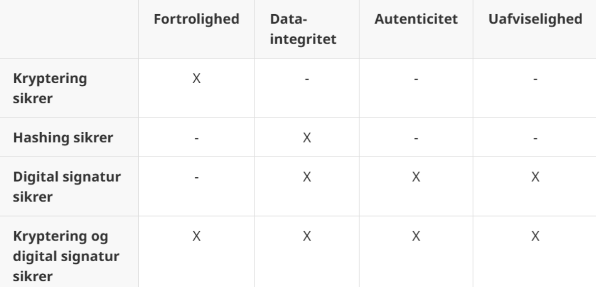
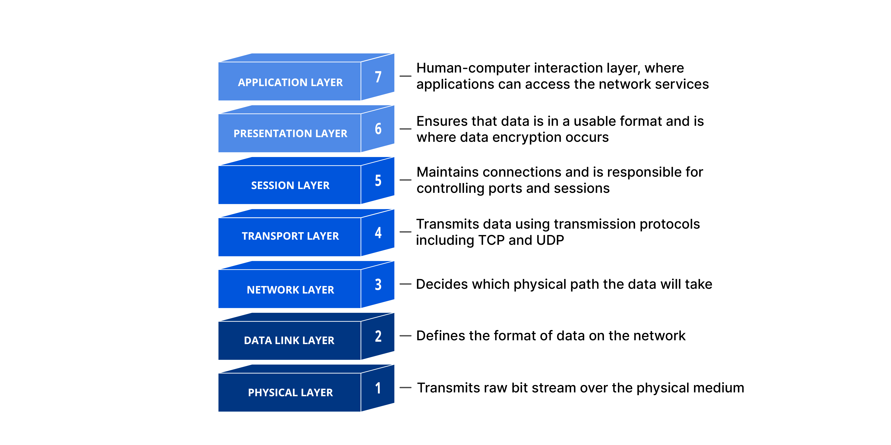
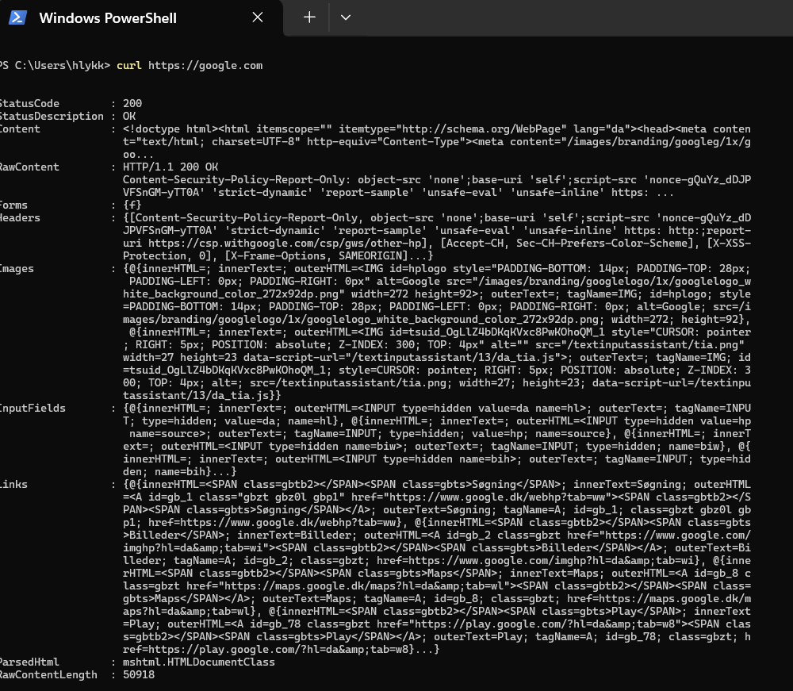
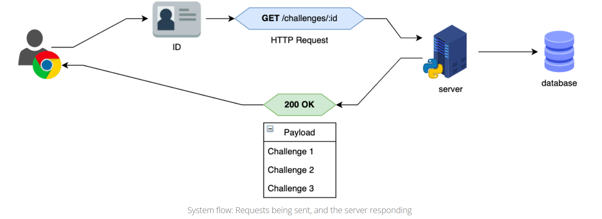
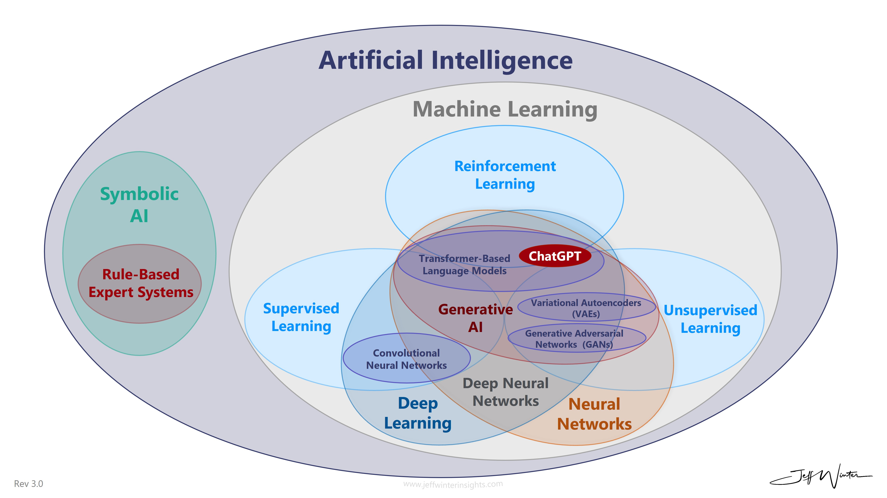
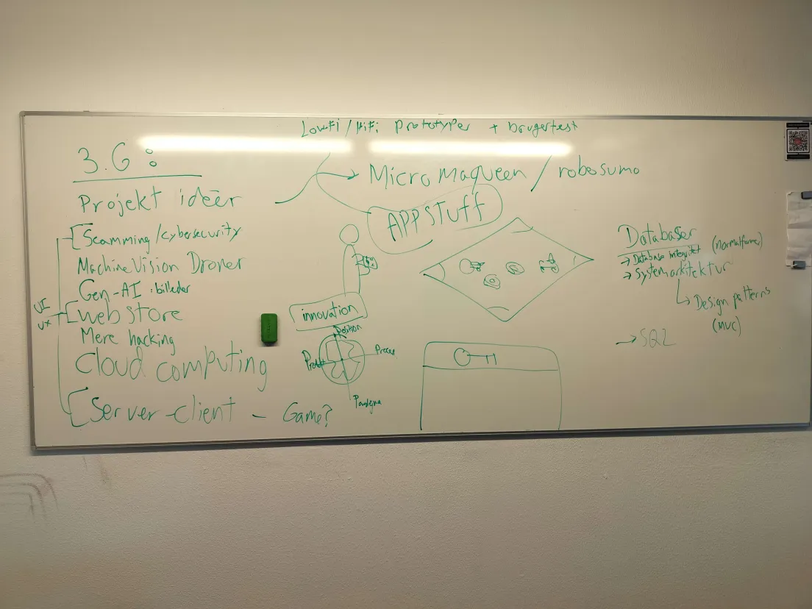

16/08/24
opg. 1: logbog:
  - nyt projekt på github
  - README: 1. Forløb - Tello dronen

opg. 2: analyse af Tello dronen som itsystem ift. 3-lags modellen:

Selve dronen
  - Præsentationslag:
    Sensoren bruges til at se omgivelserne.
  - Logiklag:
    Dronen udfører de aktioner, som den har fra datalaget.
  - Datalag:
    Sensorer, wifi, batterisensor, kamera, akcelerationsmeter, geometer
    Dronen modtager data fra appen i form af kode/de kommandoer, som brugeren har givet som input.

App
  - Præsentationslag:
    Brugeren anvender dronens app eller skriver selv kode, der får dronen til at udføre forskellige aktioner.
  - Logiklag:
    Appen går igennem den data/kode/de kommandoer, som den har fået af brugeren og sender dem til dronen.
  - Datalag:
    De kommandoer som den har fået af brugeren.

Kan bruges analytisk og generativt.

Resume af dagen:
I dag har vi lært at bruge en Tello drone. Vi har lært at skrive kode i pycharm, og sende kommandoer til dronen via dens wifi.

26/08/2024
Vi startede med at lære lidt om arduino og innovation (med 4p modellen: https://www.google.com/url?sa=i&url=https%3A%2F%2Fcloud.cct.au.dk%2Fwiki%2Findex.php%3Ftitle%3DInnovation&psig=AOvVaw0PzBB5K49oDxGKkv3aSFuH&ust=1724751968398000&source=images&cd=vfe&opi=89978449&ved=0CBQQjRxqFwoTCND4y_avkogDFQAAAAAdAAAAABAE).

Innovation (4P)
- Idégenerering til projekt dronecontroller
    BRAINSTORM - vores idéer:
    - Mind control
    - playstation 4 controller / joystick (m. laser)
    - Forsøgelsesdrone m. laser
    - grap ting og drop ting
    - Drone som følger efter person. evt. gør brug af motionsensor el. lyspunkt el. kode ting

Vi har valgt at arbejde med, at lave noget, der gør at en drone kan følge efter en.

12/09/2024

Arduino sender data til oc i form af 0/1
Den slukker og sender: TX (transmit) og RX (recieve)
baudrate: changes per second (hos arduino 115200)

Protokol: 
 - data: acc.x m/s
 - arduino: ____
 - pc/python: float

Kryptering

10/01/25
Opgave 1: DIY CRYPTO FUN TIMES

17/01/2025

- fortrolighed
    det er hemmeligt
- privathed
    andre kan ikke se det
- integratet
    af dataen
- uafviselighed
    signering

Person in the middle kan tage alice's pubkey og give en fakekey til bob, så alice snakker med darth og bob snakker med alice, mens de tror de snakker med hinanden.
Kan undgås med en webserver's certifikat, som er signeret af større firmaer fx microsoft, google, amazon osv. Hvis en bliver comprimised skal det hele opdateres ting ting.
Certifikaterne er i med npr man downloader en browser. Et firma certifikere en webside, det firma er certificeret af et andet, osv. (bygger på trust).

signalefterretning (sigint):
efterretningkilde til aflytning ovs.

steganografi (stammer fra græsk):
https://www.geeksforgeeks.org/image-steganography-in-cryptography/ 
Er opfundet før kryptering
Beskeder der ikke ligner beskever (så skjulte beskeder), fx en skjult besked i nogle afet billedes pixels.
Det er ikke kryptografisk sikkert og enhver kan i princippet finde beskeden, de skab bare vide om det, for at lede efter det.
Kaliningrad sender konstant en masse radiosignaler som ikke giver mening og så engang imellem er der en eller anden besked, men ingen kan finde den, fordi de heletiden sender gibberish.
https//:orion.moore.dk:3333 er skolens radio signal opfanger hjemmeside, hvor man kan høre en masse radiosignaler.
Stenografi er altså en besked der er gemt i en anden uskyldig besked eller i støj.

Det vigtigste i fagets projekter er læring.

24/01/2025 #LINJE 100 WOW!!!11!!!!1!1!
I dag arbejder vi videre på SIGINT projektet

19/02/2025
Vi arbejder videre på sigint projektet, og jeg arbejder på et website til det.
Vil bruge Py thon sammen med HTML - https://pyscript.net
Jeg har tilføjet et message input felt.

21/02/2025
Vi arbejder videre på sigint projektet.
Jeg har tilføjet en upload knap, en download knap og image preview funktionalitet med javaScript.

24/02/2025
I informatikfaget kigger man ud mod verden og brugeren, mens man i programmeringsfaget kigger på håndværket. Dog er programmering et redskab i informatik.
Note til eksamen: Den opgave man trækker skal der bruges python, men det kan vise overblik at lave ens anden opgave (hvor man selv vælger problemformulering) i et andet sprog, hvis det giver mening.

Dansk cybermesterskaber kategorier
Forensics: finde data
Reverse engineering: Finde data ud fra kildekoden

13/04/2025
Jeg laver opgaver om cybersikkerhed på: https://www.cybermesterskaberne.dk og har indtil videre arbejdet med decryption, og arbejder videre senere i dag.

27/03/2025
### Terminal
Sårbarheder for CVE (Common Vulnerabilities and Exposures) nummer - exploit er når man udnytter noget i systemet (så ikke det samme som en bug).
Der bliver ofte fundet sårbarheder og derfor skal man hele tiden opdatere sit system.
http: port 80
https: port 443
### OSI model
(open systems interconnection): "breaks down network communication into seven layers. These layers are useful for identifying network issues."

Tal med netværk
Step 1: mapping
curl til port scanning

"Shodan.io was developed with a primary goal: to effectively map and monitor internet-connected devices. Shodan.io enables vulnerability assessments, threat intelligence gathering, and security research by indexing and categorizing these devices."
Alle ip-adresser er scannet - se port usage.
nmap servernavn - se hvilke porte der er åbne.
Man kan også: nmap localhost - se egne porte
Curl kan sknakke http
NETCAT eller NC er ligesom cat der spytter alt den tekst der står i et program ud i terminal.
Med NETCAT kan også forbinde til port og lytte (ncat listen)

Nmap viser åbne porte på en target IP https://www.recordedfuture.com/threat-intelligence-101/tools-and-techniques/nmap-commands
eksempel: nmap 10.148.132.76

curl forbinder til webservere og viser rådata https://www.keycdn.com/support/popular-curl-examples
eksempel: curl orion.moore.dk

nc til rå forbindelser mellem maskiner (TCP/UDP) – kan både lytte og ringe https://aarhustech.itslearning.com/ContentArea/ContentArea.aspx?LocationID=47784&LocationType=1

### SGQL injection
https://guicommits.com/how-sql-injection-attack-works-with-examples/

### Studieretningsdag
Informatik er en del af studieretningen og jeg vil gerne lige gemme det her til senere.
DIY Arduino EKG-måler: https://aarhusuni.taskcards.app/#/board/6ee93724-b8ab-4843-9a3b-35c91f12e8cc/view

### Teachable Machines og Venn diagrammer

05/05/2025

Venn diagram: 
"afbildning af forhold imellem subjekt og prædikat, opfundet af den britiske logiker John Venn (1834-1923) mhp. at afgøre syllogismers logiske gyldighed. Diagrammet består af tre cirkler, som skærer hinanden, og som repræsenterer underbegreb, overbegreb og mellembegreb." - Lex

Herunder ses venn diagrammer 

I dag ser vi på lidt på teachable machines. Det er meningen at vi skal eksportere, så vi selv kan lege med det.
1. Byg en model, eller find en
2. Kør den på egen maskine

Som start bruger vi https://teachablemachine.withgoogle.com/train til nemt at arbejde med teachable machines.
Vi laver en der skal kunne se forskel på forskellige ansigtsudtryk, men den virker ikke så godt. Måske ser den med på baggrunden, eller også var billederne ikke gode nok. Der var eller 300-600 i hver kategori, hvilket nok er fint til en start.
Vi laver også en model der skal kunne kende forskel på folk - den virker fint nok.

Næste gang laver vi demo.

Derefter laver jeg en bot der scraper twitter for memes og inddeler dem i kategorier baseret på hashtags og keywords. Det tager lidt tid, men jeg er begyndt på det. 
Her bruger jeg javascript til at scrape og så gemmes filerne derefter i en SQLite database. 
Jeg overvejer at bruge Task Scheduler til at automatisere det, men der er nok en bedre måde at gøre det på.

### Informatik recap
12/05/2025
Her ser vi på de ting vi har været gennem indtil videre.

Emner:
- It & humans
- Etik
- Systemdesign
- It Arkiteknur

Projekter:
- Droner
- Kryptologi OPSEC/INTSEC
- Database/Cybersikkerhed/webstuff

### Test af teachable machine

16/05/2025

Vi har prøvet at få vores program til at køre i python.

ml5machine er godt til at lære machine learning. Det er hvad teachable machine var i gamle dage

ROI: Regien Of Interest - Den klipper fx dåse ud

De 4'er bruges til at som en samtalrestarter, det er ikke et scorecard.

Vi har brainstormet ideer til eemner vi kan have om i 3.G

